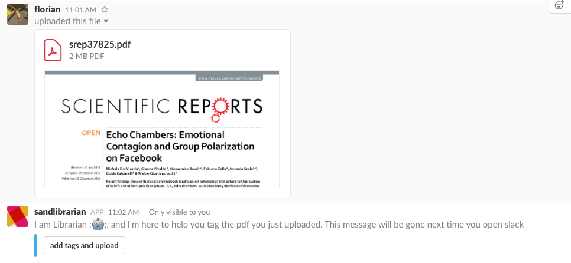
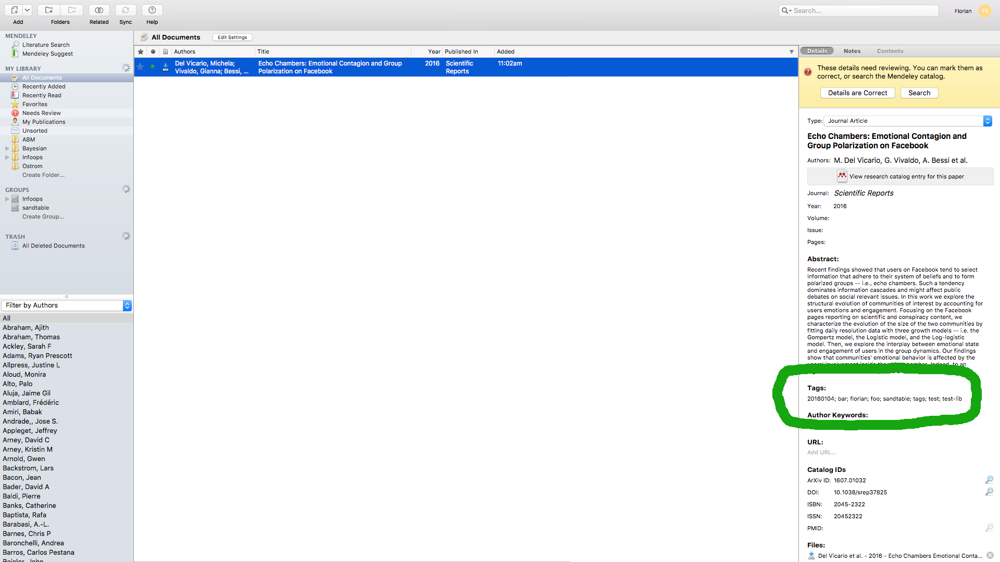

# Building a library bot for Slack to tag and save PDFs in Mendeley

## 1 Introduction

### 1.1 Background

Here at [Sandtable](www.sandtable.com) we are huge fans of Slack (at least I am). We use it within the company to communicate across projects, teams as well as with the occasional outsider. Since a lot of our projects involve a fair bit of research, we end up uploading research papers reasonably often to different Slack channels. Although there are ways to search within Slack for file types etc. (there is even a cool [deep search option](https://get.slack.help/hc/en-us/articles/213532017-Advanced-search-in-Slack#deep-search)) finding that one paper you are looking for can be challenging (and more often frustrating).

As many of our Data Scientists I come from an academic background and thus I'm used to reference managers like Mendeley to tag and manage my paper library.  If there is one thing that people learn when keeping track of literature is that if you don't put in the work in the beginning and tag/sort your papers the literature debt (just like technical debt from not testing your software) that accumulates is a pain to pay off later ....

Additionally, we rarely work alone on projects and getting everyone in a company to remember to put in some keywords every time they upload a PDF to Slack is challenging to say the least. Therefore, I wanted to create a process that prompts the user to tag and upload the PDF but that is as frictionless as possible. In the end, this should be something that just works and nobody realises how good it is simply because it does not seem like an effort. As things got quieter towards Christmas and I had another of those frustrating paper hunts behind me I decided to explore potential solutions to this dilemma (it might also just be my bad memory...).

As I am not a software developer by training some of the code below might not be up to scratch and could be improved. If you have suggestions or find bugs, please feel free to raise an issue or contribute a PR on the github repo for this [project](https://github.com/sandtable/sandlibrarian).

### 1.2 Tools and workflow

In order to select the right set-up, I looked for reference managers with an existing API that I could just use out-of-the-box. Slack provides an excellent set of APIs as well as Python bindings and luckily Mendeley has an API + Python SDK as well. However, the latter (in particular the Python bit) has not been updated since 2015 and some of the functionality in the general API is not available in the Python SDK. After building a pretty standard Slack Bot as a start point (following this great [tutorial](https://www.fullstackpython.com/blog/build-first-slack-bot-python.html)) using just a single Python function I realised that I had to move to a Flask app to be able to handle interactions like tagging dynamically.

### 1.3 My idea of a general workflow was as follows:

-   A user uploads a file to Slack
-   If that file is a PDF the user should be asked if he wants to add tags to the PDF and upload it to Mendeley
-   In case the user chooses to do so, she/he should be prompted with a text window to enter some comma separated tags and submit everything with the click of a button.

#### Different initial workflow

Originally, I uploaded the PDFs to Mendeley straight after they were uploaded to Slack, however that neglected the fact that people might share CVs, contracts or paper drafts on Slack which they would not necessarily want to upload to Mendeley.

### 1.4 Resources and packages

-   [Slack API](https://api.slack.com/)
-   [Mendeley API](http://dev.mendeley.com/)
-   [Python](https://www.python.org/)
-   [virtualenv](https://virtualenv.pypa.io/en/stable/)
-   [ngrok](https://ngrok.com/)

## 2 Building the slack library bot

### 2.1 Setting up the environment

I worked on a Mac and used Python 3.6 and `virtualenv`. I started of with setting up a virtual environment via `virtualenv -p /usr/local/bin/python3 env` in the project folder, entering the environment `source env/bin/activate` and installing the Slackclient `pip install slackclient`.

### 2.2 Setting up a Slack app

Similar to section (4) a lot of this set-up comes from [FullStackPython](https://www.fullstackpython.com/blog/build-first-slack-bot-python.html) who have done a great job in providing everything needed to get started with a basic Slackbot. Here I include a brief summary of the steps for completion but please have a look on their website for more details.

-   To start off with our Slackbot we need to set-up an app first. Create your app [here](https://api.slack.com/apps/new).
-   To create a bot user, go to [here](https://api.slack.com/bot-users) and pick your own awesome bot name.
-   Install the bot into your workspace by clicking on `Install App` under settings.
-   After installation, you will be able to find the necessary bot OAuth token either under `Basic Information` or `OAuth & Permissions`.
-   The Slackbot token should then be exported as environment variable. `export SLACK_BOT_TOKEN='xxxxx'`

### 2.3 Setting up the Slackbot to react to file uploads

In order to get your Slackbot to react to a file upload (pdf upload more specifically) we need to listen for events in our Slack workspace. This can either be done by running and infinite loop that processes events through Slacks real time message API using something like `slack_client.rtm_read()`.

The other option is to subscribe the bot to specific events which will allow the bot to listen at an http endpoint for any event that it is subscribed to. If such an event is triggered, Slack will send the necessary information to that endpoint. In my first version, I wanted to avoid to build the bot as an Flask app. However, as soon as you want to use any form of interactive message elements using an infinite loop set-up described in the FullStackPython tutorial does not work anymore. Additionally, the authentification method required by Mendeley meant that packaging everything up in a Flask app made more sense.

After deciding on the Flask app approach I cloned one of the excellent [Python-Onboarding-Tutorial](https://github.com/slackapi/Slack-Python-Onboarding-Tutorial) from the Slack developers and stripped out most of the code not needed for my purposes (and code that I did not understand initially :D I prefer it that way so that I can get to an MVP quick and then add anything from the inital code that might be necessary).

I built my bot around some bits from `app.py` of the aforementioned Python-Onboarding-Tutorial as well as code from the [dialog example](https://github.com/slackapi/python-dialog-example). From `app.py` I used the `_event_handler` function as well as the `/listening` route and removed the remaining functions. I kept the `/listening` endpoint the same excepting adding some lines around the Mendeley session (I go into more detail around Mendeley set-up later). The code changes look the following:

original:
```python
...
slack_event = json.loads(request.data)

  # ============= Slack URL Verification ============ #
...
```
modified:
```python
...
slack_event = json.loads(request.data)
if 'session' in mendeley_token.keys():
    mendeley_session = mendeley_token['session']
else:
    mendeley_session = None

  # ============= Slack URL Verification ============ #
...
```

I modified the `_event_handler` function substantially to suit my purposes. First, I am checking if the `event_type` coming from Slack is of `file_shared` which is the event indicating that a file has been uploaded and shared in a particular channel. For reasons that are not quite clear to me at the moment of writing this, the `file_shared` event got triggered multiple times in some instances. Thus, I added a line that exits the function early if an event is processed that previously has been already handled. I do this by adding the file id to a list and checking if the current id is already in that list.

```python
def _event_handler(event_type, slack_event, mendeley_session):
    """
    A helper function that routes events from Slack to our Bot
    by event type and subtype.

    Parameters
    ----------
    event_type : str
        type of event recieved from Slack
    slack_event : dict
        JSON response from a Slack reaction event

    Returns
    ----------
    obj
        Response object with 200 - ok or 500 - No Event Handler error

    """

    # ================ file share events =============== #
    # When the user uploads a pdf, the type of event will be file_shared
    if event_type == 'file_shared':
        # check if the file id has been processed already
        # for some reasons sometimes we get two/three events.
        if slack_event['event']['file']['id'] in processed_tokens:
            return make_response("Welcome Message Sent", 200,)
        # add file id to processed file list
        processed_tokens.append(slack_event['event']['file']['id'])
```

## 3 Get the slack library bot to engage the user after a file upload

### 3.1 Send message to user after the file upload

Next, we need to check if the file that was just uploaded is of type PDF in order to decide if we ask the user to tag and upload it to Mendeley. For this we need to send a get request to the `/file.info` endpoint of the slack web API using the file id. We can then check if the file has been uploaded correctly and what type it is.

```python
# get the info of the file that was just uploaded
webhook_url = "https://slack.com/api/files.info"
slack_data = {'token': os.environ.get('SLACK_BOT_TOKEN'),
              'file': slack_event["event"]['file_id']}
req = requests.post(webhook_url, data=slack_data,
                    headers={'Content-Type':
                             'application/x-www-form-urlencoded'})

file_info = json.loads(req.content)
# check if the file has been uploaded correctly and if it's type is pdf
if file_info['ok'] and file_info['file']['filetype'] == 'pdf':
```

Once we have verified that the file is uploaded and indeed of type PDF we should send a message to the user offering to tag and upload the PDF to Mendeley. For this we will be using [ephemeral messages](https://api.slack.com/methods/chat.postEphemeral) in Slack. These have advantages and disadvantages. The main advantage they pose is that they prevent the cluttering of channels by bot messages because they can just be seen by a specific user as well as being removed from the conversation automatically once the Slack client is restarted. Disadvantages include the fact that ephemeral messages can't be updated like normal chat messages which increases the number of messages that a user receives. However, because the messages are removed automatically later on, this seemed like a reasonable trade-off.

We thus send a message to the user who uploaded the document asking if he/her would like to tag the PDf and upload it. This message includes an interaction trigger which Slack calls a message attachment. The attachment in the Slack message allows us to trigger a [dialog sequence](https://api.slack.com/dialogs) in which the user can enter the tags and with a button click upload the PDF to Mendeley. (As a note, a lot of interactive elements in Slack work with a 3 second time-out which we will come across again later in this post.)

```python
if file_info['ok'] and file_info['file']['filetype'] == 'pdf':
    # inform user that he can upload and tag the file he just added
    # do this as ephemeral message to not spam all users
    _ = slack_client.api_call(
      "chat.postEphemeral",
      as_user=True,
      channel=file_info['file']["channels"][0],
      user=file_info['file']["user"],
      text="I am Librarian ::robot_face::, and I\'m here to help you tag the pdf you just uploaded. This message will be gone next time you open slack",
      attachments=[{
        "text": "",
        "callback_id": (slack_event["event"]['user_id'] +
                        "pdf_tag_form"),
        "color": "#3AA3E3",
        "attachment_type": "default",
        "actions": [{
          "name": "pdf_tag",
          "text": "add tags and upload",
          "type": "button",
          "value": "pdf_tag"
        }]
      }]
    )
    # add some info to the pdf tag dict so that it can be used
    # by the endpoint that deals with the responses from slack
    PDF_TAGS[slack_event["event"]['user_id']] = {
        "order_channel": file_info['file']["channels"][0],
        "message_ts": "",
        "doc_url": file_info['file']['url_private'],
        'doc_name': file_info['file']['name']
    }
return make_response("Welcome Message Sent", 200,)
```

We have also added some meta data to a dictionary which will be used by the endpoint that handles the user interaction in the dialog sequence. This info includes which channel was used as well as the URL and name of the pdf that was uploaded.

### 3.2 Interact with the user during the tagging dialog

As previously mentioned now our uploading user will have 3 seconds to trigger the dialog with the bot in order to tag and upload the pdf. All interactions with interactive messages will be forwarded by Slack to the `message_actions` endpoint (this will be set-up together with the events subscription in section 6 because it needs a roughly working App to finish). Using the Python dialog repo as reference I build the `/slack/message_actions` endpoint to handle further interactions.

First, we load the payload we get from Slack on that endpoint and verify that the message action came Slack.

```python
@app.route("/slack/message_actions", methods=["POST"])
def message_actions():
    """This function receives and message actions and processess it.

    This function has to return a HTTP 200 response within 3 seconds.
    It handles all the processing of users responses to interactive elements.
    """
    # Parse the request payload
    message_action = json.loads(request.form["payload"])
    # check the verification token
    if message_action['token'] == SLACK_VERIFICATION_TOKEN:
```

Next, we check if the incoming action is of type `interactive_message` in which case we know that the user triggered the tagging process by clicking on the button we send him in the attachment of the previous ephemeral message. We therefore want to open a dialog with the user and offer a text area for him/her to enter the tags that should be added to the pdf before upload. We also send a message to keep the user informed on the progress.

```python
elif (message_action["type"] == "interactive_message"):
    # Open a dialog to the user to let him add tags to the pdf
    PDF_TAGS[user_id]["message_ts"] = message_action["message_ts"]

    slack_client.api_call(
        "dialog.open",
        trigger_id=message_action["trigger_id"],
        dialog={
            "title": "Tag the pdf",
            "submit_label": "Submit",
            "callback_id": user_id + "pdf_tag_form",
            "elements": [
                {
                    "label": "add tags",
                    "type": "textarea",
                    "name": "tags",
                    "placeholder": "insert tags as simple comma separated words (e.g. byroniser, agent based model, test)",
                }
            ]
        }
    )

    # Update the user that things are happening
    slack_client.api_call(
      "chat.postEphemeral",
      as_user=True,
      channel=PDF_TAGS[user_id]["order_channel"],
      user=user_id,
      text="Tagging the pdf",
      attachments=[]
    )
```

Once the user has entered the tags for the PDF and hit the submit button this action will be captured by the same endpoint. For this purpose, we add an `elif` statement that checks if the message action type is a `dialog_submission`. If that is the case we want to extract the tags upload the PDF with tags to Mendeley and inform the user that everything has been done. In the next section I will go into detail on how to create the Mendeley session but for now let's assume we have the `mendeley_session` object ready to upload our pdf and tag it once it is uploaded.

In order to upload the PDF, we first have to download it from Slack and then upload it to Mendeley. While this is pretty straightforward by itself, we will be hitting the 3 second timeout associated with interactinve elements. In my initial implementation, the PDF was successfully downloaded from Slack then uploaded to Mendeley and tagged. However, because all this took longer than 3 seconds, the dialog window did not close because Slack expects an `HTTP 200 response` as a return of the endpoint function within 3 seconds. Some solutions involved using `results_url` for interactive messages but it seems not to be working for dialogs. Therefore, in the implementation below I use threading to kick-off the download-upload-tag process separately and return the `200 HTTP response` in time for Slack to close my dialog box. For this we need to import the threading module and write a small function handling the download-upload-tag task.

```python
from threading import Thread

def process_data(doc_url, doc_name, tags):
    """This function handles the pdf upload to Mendeley.

    Parameters
    ----------
    doc_url: str
        slack url where the pdf can be found
    doc_name: str
        name of the file to be uploaded to Mendeley
    tags: list
        list of strings to be added as tags to the pdf

    We use a separate function here for the pdf upload as the slack
    dialog needs an HTTP 200 response within 3 seconds. This function
    gets called within a thread started by the interactive slack dialog for
    uploading and tagging. We first need to download the pdf from slack
    and then use the mendeley api to create a new document from a
    request response.
    """
    req_down = requests.get(doc_url,
                            headers={"Authorization": "Bearer %s"
                                     % os.environ.get('SLACK_BOT_TOKEN')})
    doc = (mendeley_token['session'].documents
           .create_pdf_from_requests(req_down.content, doc_name))
    _ = doc.update(tags=tags)
```

This function also includes a function `mendeley.documents.create_pdf_from_requests` which is not part of the standard Mendeley Python SDK but which is a modified version of the `mendeley.documents.create_pdf` function that I added and which can be found as a [PR](https://github.com/Mendeley/mendeley-python-sdk/pull/22). It just adds the option to upload from a request response rather than having write/read the file to/from disk.

We can then wrap up our `/message_action` endpoint as described.

```python
elif (message_action["type"] == "dialog_submission" and
      'inserted_token' not in message_action['submission'].keys()):
    tag_order = PDF_TAGS[user_id]
    doc_url = tag_order["doc_url"]
    tags = message_action['submission']['tags'].split(",")
    # Update the user that the pdf was tagged and is being uploaded
    slack_client.api_call(
      "chat.postEphemeral",
      as_user=True,
      channel=PDF_TAGS[user_id]["order_channel"],
      user=user_id,
      text="Tagging complete uploading to mendeley",
      attachments=[]
    )
    t = Thread(target=process_data,
               args=(doc_url, tag_order['doc_name'], tags))
    t.start()

return make_response("", 200)
```

This finishes off the document handling part of the project.

## 4 Setting up Mendeley API

### 4.1 Creating an app for Mendeley

This sub-section on setting up the app on Mendeley is mostly based on the info from [here](https://github.com/Mendeley/mendeley-api-python-example) but I briefly describe it here for completion. In order to be able to use the Mendeley API an Mendeley app has to be created a secret generated and a redirect link set. This can be done under [Mendeley dev](http://dev.mendeley.com/) under My applications. Register a new app and for development use `http://localhost:5000/oauth` as redirect URL.


The ID and the secret that were created should go into two environment variables which you will need later. I also added the redirect URL as environment variable because that will later be set to the domain to which you deploy. Something like `https://foo.bar.com/oauth`.

The Python bindings can be installed via `pip install git+https://github.com/Florian-Roessler/mendeley-python-sdk.git@document_from_requests` and we import the package and environment variables.

```python
import os
from mendeley import Mendeley

MENDELEY_CLIENTID = os.environ["CLIENTIDENV"]
MENDELEY_CLIENTSECRET = os.environ["CLIENTSECRETENV"]
MENDELEY_REDIRECT = os.environ["REDIRECTENV"]
```

### 4.2 Code for initialising the Mendeley client

This turned out to be a bit of a problem at first but I am reasonable happy with the solution I ended up with. Mendeley offers three [authentification flows](http://dev.mendeley.com/reference/topics/authorization_overview.html) that provide different levels of access to the users database. Two of them require the user to log-in via a website to obtain a session token and one can be performed without user interaction. Of course, the level of access that allows writing to the users Mendeley database can only be obtained by having the user log in through the website. I also had an initial version running where I could post the auth URL in the command line but because the final deployment would be via kubernetes that was of course not a long-term solution. Thus, I decided to get the bot to send me a message with the auth link via Slack and give me 20 seconds to get the auth token and send it to the app via another message dialog. This happens once when the app is launched and since the Mendeley API can refresh the token this should hopefully only have to be done once (this is to be tested).

So, let's create a Mendeley instance and start the auth workflow to get the auth link that we then send to the user using our Slack bot. Then we wait 20 seconds and present him with the dialog trigger. I am using 20 seconds delay here again because of the 3 seconds time-out on interactive content from Slack. This is part of the `app.py` function.

```python
men = Mendeley(MENDELEY_CLIENTID, MENDELEY_CLIENTSECRET,
               MENDELEY_REDIRECT)
auth = men.start_authorization_code_flow()
# message user to authorise mendeley api
response = slack_client.api_call(
  "chat.postMessage",
  as_user=True,
  channel=SLACK_MENDELEY_LOGIN,
  text="Please go to this URL and login with your Mendeley account. After the successful login you will get to an error page. Copy the url of this error page and past it into the interactive dialog created by this bot in ~20 seconds: %s" % auth.get_login_url(),
  attachments=[]
)
# give the user 20 seconds to retrieve the token (3 second timeout on the
# interactive message)
time.sleep(20)
token_dm = slack_client.api_call(
  "chat.postMessage",
  as_user=True,
  channel=SLACK_MENDELEY_LOGIN,
  text="I am Librarian ::robot_face::, please give me a token",
  attachments=[{
    "text": "",
    "callback_id": SLACK_MENDELEY_LOGIN + "token",
    "color": "#3AA3E3",
    "attachment_type": "default",
    "actions": [{
      "name": "token",
      "text": "insert the url please",
      "type": "button",
      "value": "token"
    }]
  }]
)
```

Following this, Slack will send us the response to the `message_action` endpoint so we have to include another `elif` statement there that handles the token response.

```python
# If it is an interactive message swith the token action open a dialog
    # for the user to enter the token url
    if (message_action["type"] == "interactive_message" and
            message_action['actions'][0]['name'] == 'token'):
        mendeley_token['message_ts'] = message_action["message_ts"]
        _ = slack_client.api_call(
            "dialog.open",
            trigger_id=message_action["trigger_id"],
            dialog={
                "title": "Get token from here",
                "submit_label": "Submit",
                "callback_id": SLACK_MENDELEY_LOGIN + "token",
                "elements": [
                    {
                        "label": "token",
                        "type": "text",
                        "name": "inserted_token",
                        "value": "",
                    }
                ]
            }
        )
```

Of course, we need to handle the users submission of the token itself. The pasted auth link will be used to finalise the creation of the `mendeley_session` object and safe it in the `mendeley_token` dictonary that we use to pass the session around the different functions (probably a better solution necessary.)

```python
elif (message_action["type"] == "dialog_submission" and
          'inserted_token' in message_action['submission'].keys()):
        mendeley_token['session'] = auth.authenticate(
            message_action['submission']['inserted_token'])
        slack_client.api_call(
            "chat.update",
            channel=SLACK_MENDELEY_LOGIN,
            ts=mendeley_token["message_ts"],
            text=":white_check_mark: PDF tagged!",
            attachments=[]
        )
```

## 5 Setting up docker

Finally, before Celine (our amazing DevOps) can deploy the whole thing to Kubernetes we need to build a docker container and make sure everything runs (thanks to Celine for helping with that). For that purpose, we create a Dockerfile that builds an image based on the Python alpine image. Additionally we had to start the Flask app using `app.run(0.0.0.0)` in order for Slack to be able to reach our `/message_actions` endpoint.

```
FROM python:3.6.4-alpine3.7

# install git so that we can install Mendeley SDK from github
RUN apk add --no-cache --virtual .build-deps git

COPY requirements.txt /app/requirements.txt

RUN pip install --no-cache-dir -r /app/requirements.txt
# we can remove all deps installed before here to keep the image small
RUN apk del .build-deps

COPY sandlibrarian.py /app/
WORKDIR /app/

CMD python app.py
```

To make the testing easier a docker-compose file allows us to set all necessary environment variables and start the service on the right port.

```
sandlibrarian:
  build: .
  ports:
    - "5000:5000"
  environment:
    MENDELEY_REDIRECT: http://localhost:5000/oauth
    SLACK_BOT_TOKEN: ${SLACK_BOT_TOKEN}
    SLACK_VERIFICATION_TOKEN: ${SLACK_VERIFICATION_TOKEN}
    MENDELEY_CLIENTID: ${MENDELEY_CLIENTID}
    MENDELEY_CLIENTSECRET: ${MENDELEY_CLIENTSECRET}
    SLACK_MENDELEY_USER: ${SLACK_MENDELEY_USER}
```

## 6 Events subscription and testing things!

Now that all the coding is done let's finish the last bits of set-up procedure on the Slack website. This again is described in more detail [here](https://github.com/slackapi/Slack-Python-Onboarding-Tutorial/blob/master/README.md#pythonboarding-bot) but included for completion.

-   Create a test channel in your Slack app and invite your Bot
-   Subscribe to events needed to run your bot in my case these were: `channel_history_changed`, `emoji_changed`, `file_shared`, `group_history_changed`, `im_close`, `im_created`, `im_history_changed`, `im_open`, `message_channels`, `message_groups`, `message_im`, `message_mpim`, `reaction_added` and `reaction_removed`
-   Start the app locally using `python app.py` or using your docker container `docker-compose up`. This probably will lead the bot to message you with the purposes of logging into the Mendeley app but we first need to set up the handling of interactive messages so we ignore that message for now.
-   In a separate terminal window, start a tunnel to your localhost to forward Slack commands using ngrok `ngrok http 5000`, from there copy the https link and insert it in the request URL field on the Slack events subscription page adding a `/listening` at the end. (should look something like `https://somenumbers.ngrok.io/listening`) and if your challenge response in your app (`app.py`) is working correctly you get a verified tick on the website.
-   flip the enable events switch and events should come flooding in.
-   next we head to the Interactive Message subsection on the Slack website and there we add a request URL similar to the previous one that points to `/message_actions` endpoint `https://somenumbers.ngrok.io/message_actions`.

Let's restart the Slackbot script or docker container to and see if we can get the Mendeley API up and running. `python app.py` or `docker-compose up`


Ok we get the auth link for Slack, lets head over and log-in to retrieve the auth URL. That URL gets inserted in the interactive dialog and that should be it. (Maybe we should send a confirmation message to the user at this point? Something for the TODO)


OK cool all good let's upload a PDF in the test channel and see if we can tag it.




Last check is if it pops up in Mendeley itself, so let's head over there.



YES! Great, from now on all PDFs can be tagged and uploaded.


## 7 Wrap up

Hopefully this blog post can help others set up their own Slack bot for handling PDFs or for other purposes and give another example on how we can easily combine existing services to improve our day-to-day workflows. I already have some ideas on next steps for this project, e.g. adding default tags handle the Mendeley session a bit better etc. Any questions or feedback are much appreciated.

## 8 Links and Resources

### 8.1 Mendeley bits:

[Register a new Mendeley app](http://dev.mendeley.com/)

[Mendeley API documentation](http://dev.mendeley.com/methods/)

[Mendeley swagger](https://api.mendeley.com/apidocs/docs)

[Mendeley Python SDK](https://github.com/Mendeley/mendeley-python-sdk)

[Mendeley example 1](https://github.com/Mendeley/mendeley-api-python-example) and [Mendeley example 2](https://github.com/Mendeley/mendeley-api-python-catalog-example/blob/master/mendeley-catalog.py)

8[My PR for the Mendeley SDK](https://github.com/Mendeley/mendeley-python-sdk/pull/22)

### 8.2 Slack bits:

[Simple Slack bot example](https://www.fullstackpython.com/blog/build-first-slack-bot-python.html)

[Python app tutorial from Slack](https://github.com/slackapi/Slack-Python-Onboarding-Tutorial/blob/master/README.md#pythonboarding-bot)

[Ngrok to forward Slack connections](https://api.slack.com/tutorials/tunneling-with-ngrok)

[Slack dialogs in Python](https://github.com/slackapi/python-dialog-example)

[Interactive Slack messages in Python](https://github.com/slackapi/python-message-menu-example)

[Ephemeral messages](https://api.slack.com/methods/chat.postEphemeral)

### 8.3 Additional stuff:

[How Do I Return a HTTP Response to Caller and Continue Processing](https://alyssaq.github.io/2014/how-do-I-return-a-http-response-to-caller-and-continue-processing/)
